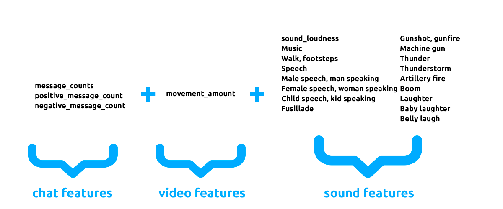
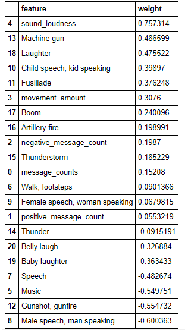
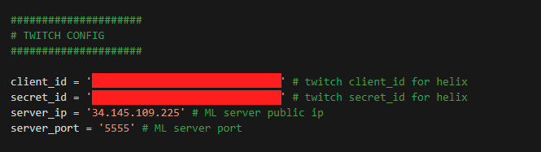
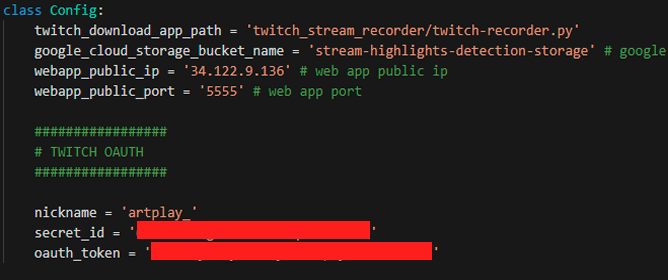
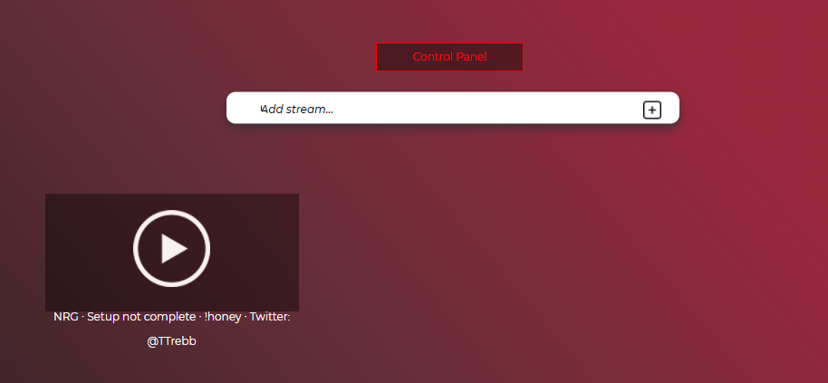
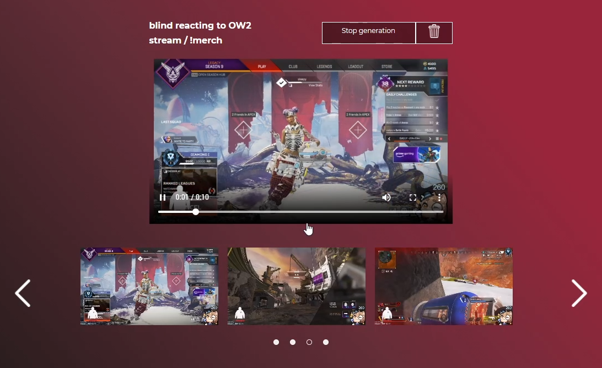

# Twitch Stream Highlights Detection with Machine Learning
This repository contains a web app + server side app for auto highlights generation during a twitch stream live!
I utilize the power of machine learning to extract features from sound, motion and live chat to predict highlights from video game streams on twitch!  
<b>You can find blog post about the problem [Here](https://artkulakov.medium.com/how-i-created-an-app-for-live-stream-highlight-detection-for-twitch-532f4027987e)</b>

For that I use the combination of the following features:

* For audio tagging I use the code from [this repository](https://github.com/qiuqiangkong/audioset_tagging_cnn)
* For chat sentiment analysis I use transformers, same as in [this tutorial](https://huggingface.co/transformers/quicktour.html)
* For movement scoring I use the approach similar to the approach I proposed in [this repository](https://github.com/artkulak/workout-movement-counting)

Those features are extracted in real time for 10 second clips, after that they are passed to the metamodel, which predicts the probability of the clip to be a highlight. As the metamodel I chose Logistic Regression, because it is fast and easily interpritable! Here are the feature importances of the final meta model:

To run the web app and the server follow the instructions below.

## Repository structure

* Branch `main` contains the code for the web app
* Branch `Feature/server` contains the code for the server part
* Branch `Feature/metamodel` contains the code for training the metamodel
* Branch `Feature/movement` contains some POC code for the movement model to work

## Instructions

The app consists of two parts: the server part (the server is responsible for processing live broadcasts and running machine learning models) and the client part (the web application is responsible for communicating with the server).
To install two separate components, we will need access to the Google Cloud platform, namely Google Cloud Compute and Google Cloud Storage.
After creating 2 cloud instances and setting up the Firewall, you can start setting up.

1. Select one of the machines as the environment for the web application and clone the main branch of the following repository: [Link](https://github.com/artkulak/stream-highlights-detection)
2.Using the `pip install –r requirements.txt` command, install all the necessary libraries for the web application to work
3. Install the server on another machine, for this we clone the branch: [Link](https://github.com/artkulak/stream-highlights-detection/tree/Feature/server)
4. Using the `pip install –r requirements.txt` command, install all the necessary libraries for the server to work.
5. Now you need to create a bucket in Google Cloud Storage and make it public. After setting up and creating a bucket, remember its name.
6. Set up config for the web application, for this open the file `webapp/viewer/config.py` and enter the following data 

7. Set up config for the server, which is located in `server/config.py`

8. Now we can launch the web application and the server. To launch the web application in the root directory of the repository, enter the command:

`python manage.py runserver 0.0.0.0:5555`

To start the server in the root directory of the repository, enter the command:

`python server.py`

## App overview

When navigating to the public IP address of the web application, you will see the login panel, in which you can enter the data of an existing user or create a new one.
I didn't erase the SQLite database so you can use my credentials to login, `user: artkulak password: 123456`. If you wish to create a new user you can either do that from django admin panel or erase the `webapp/db.sqlite3` database and do basic django user creation process from scratch.

When you are logged in, you can type the stream name you want to track in the following field:

The stream will appear just below:

At this moment django had sent a request to the server and it started to process highlights, if you had done everything correctly they will start to appear on the stream page.

You can also delete the stream with a Trash button in the upper right corner.

Here is a small demo of the working code: [Link](https://disk.yandex.ru/d/UnGKyR7L65K8NQ)

